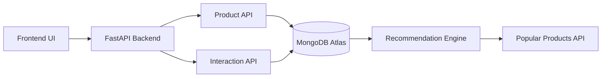
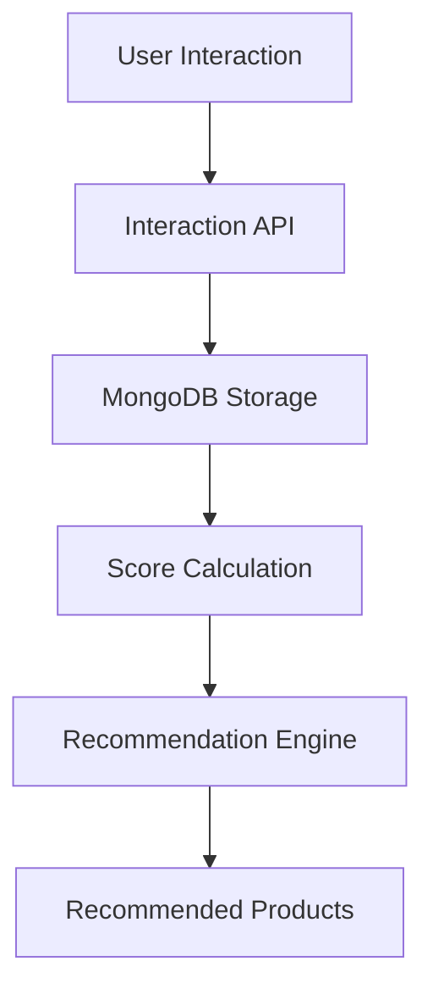

# 🚀 AI Product Recommendation System


An **AI-powered recommendation backend** that tracks user interactions and generates product recommendations using behavioral data.

The system collects user activity such as **views, clicks, cart actions, and purchases**, converts them into weighted scores, and uses this data to generate **popular and personalized recommendations**.

---

# 📌 Features

* Product catalog management
* User interaction tracking
* Interaction scoring engine
* Popularity-based recommendations
* RESTful API with FastAPI
* MongoDB Atlas cloud database
* Auto-generated API documentation using Swagger

---

# 🧠 How the Recommendation System Works

The system learns user preferences based on interaction behavior.

### Interaction Types

| Interaction | Score |
| ----------- | ----- |
| View        | 1     |
| Click       | 2     |
| Add to Cart | 3     |
| Purchase    | 5     |

Higher interaction scores indicate **stronger user interest in a product**.

Example:

```json
{
"user_id": "user123",
"product_id": "iPhone 14",
"interaction_type": "purchase",
"score": 5
}
```

These scores are aggregated to determine **product popularity and relevance**.

---

# 🏗 System Architecture



---

# ⚙️ Tech Stack

### Backend

* FastAPI
* Python

### Database

* MongoDB Atlas
* PyMongo

### Machine Learning (Planned)

* Scikit-learn
* Pandas
* Cosine Similarity

### Tools

* Git
* GitHub
* Swagger Docs

---

# 📂 Project Structure

```
AI-Product-Recommendation-System
│
├── backend
│   ├── app
│   │
│   ├── models
│   │   ├── product_model.py
│   │   └── interaction_model.py
│   │
│   ├── routes
│   │   ├── product_routes.py
│   │   └── interaction_routes.py
│   │
│   ├── database.py
│   └── main.py
│
├── frontend
│
├── ml_service
│
└── docs
```

---

# 🔌 API Endpoints

### Product APIs

| Method | Endpoint       | Description        |
| ------ | -------------- | ------------------ |
| POST   | `/add-product` | Add new product    |
| GET    | `/products`    | Fetch all products |

Example Request

```json
{
"name": "iPhone 14",
"category": "Electronics",
"description": "Apple smartphone",
"price": 70000,
"image_url": "https://example.com/iphone.jpg"
}
```

---

### Interaction APIs

| Method | Endpoint             | Description            |
| ------ | -------------------- | ---------------------- |
| POST   | `/track-interaction` | Track user interaction |
| GET    | `/interactions`      | Retrieve interactions  |

Example Request

```json
{
"user_id": "user123",
"product_id": "iPhone 14",
"interaction_type": "view"
}
```

---

### Recommendation API

| Method | Endpoint            | Description              |
| ------ | ------------------- | ------------------------ |
| GET    | `/popular-products` | Get recommended products |

Example Output

```json
[
{
"product_id": "iPhone 14",
"total_score": 6
}
]
```

---

# 🚀 Getting Started

## Clone Repository

```
git clone https://github.com/Amey-Kalsapnavar/AI-Product-Recommendation-System.git
cd AI-Product-Recommendation-System
```

---

## Setup Backend

```
cd backend

python -m venv venv
venv\Scripts\activate

pip install -r requirements.txt
```

---

## Run Server

```
uvicorn app.main:app --reload
```

Server runs at

```
http://127.0.0.1:8000
```

Swagger API Docs

```
http://127.0.0.1:8000/docs
```

---

# 🧩 Future Enhancements

* Content-based recommendation
* Collaborative filtering
* Hybrid recommendation system
* Personalized user recommendations
* Frontend dashboard
* Model deployment

---

# 📊 Recommendation Pipeline



---

# 📜 License

This project is licensed under the **MIT License**.

---

# 👨‍💻 Author

**Amey Kalsapnavar**

Information Technology
Vishwakarma Institute of Information Technology, Pune

GitHub
https://github.com/Amey-Kalsapnavar
